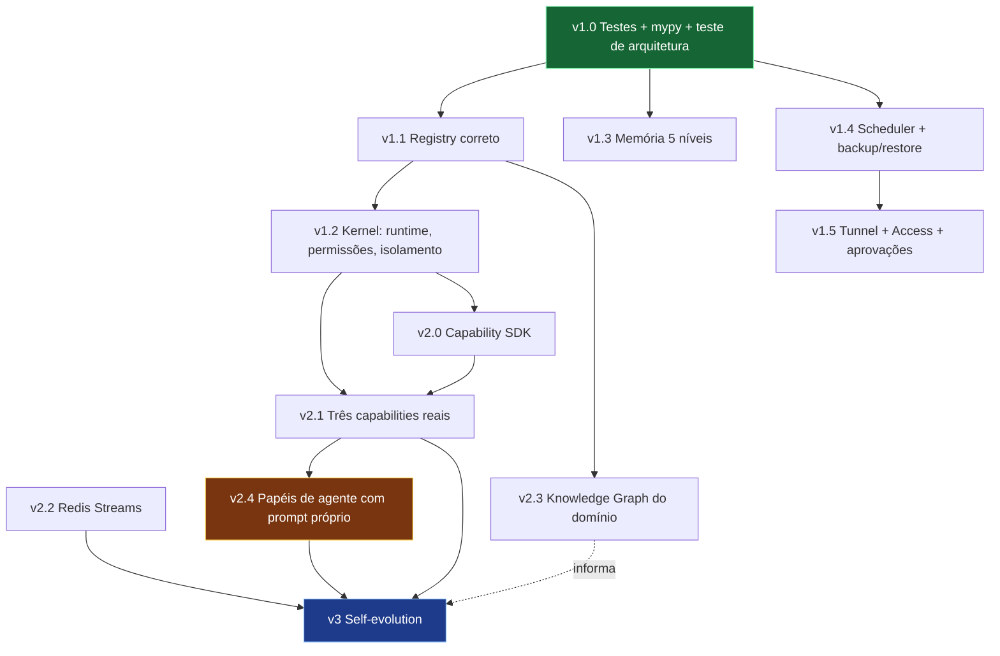

# Jarvis — Plano de execução v1 → v3

Complemento operacional do `plan.md`. Onde `plan.md` diz *o que* e *por quê*,
este diz *em que ordem*, *com qual critério de aceite* e *o que já está pronto*.

- `plan.md` — visão, arquitetura conceitual, decisões fechadas.
- `tools.md` — stack, versões, contratos.
- `plan-scheme.md` — layout de pastas.
- **este arquivo** — fatias de trabalho, dependências, aceite.

Regra do documento: **aceite binário**. "Pronto" é o critério passar, nunca a
sensação de estar perto. Fatia sem critério verificável não entra.

---

## 1. Estado real hoje (auditado, não declarado)

v0 e v0.5 marcados como feitos. Auditoria do código em 2026-07-29, revisada em
2026-07-30 (segunda auditoria, máquina de trabalho).

### Existe e funciona

| Área | Onde | Observação |
|---|---|---|
| Contratos tipados | `packages/shared/contracts.py` | `Goal`, `Task`, `Event`, `EventType`, `CapabilityManifest`, `CapabilityPermissions`. Pydantic, fonte única. Sólido. |
| Portas | `packages/shared/ports.py` | `GoalStore`, `ConversationStore`, `ToolExecutor`, `EventBus`. Protocols. É o que impede `packages/` de importar SQLAlchemy. |
| Persistência | `apps/api/db/{models,repository}.py` | `PgGoalStore`, `PgConversationStore`, Alembic com 2 migrations. |
| Chief AI | `packages/agents/chief.py` | Núcleo v0: mensagem → LLM com tools → resposta. |
| Goal/Executive | `packages/agents/{goal_manager,executive}.py` | Fila, resume após restart, checkpoint por task. |
| Provider LLM | `packages/llm/{base,anthropic_provider,openai_provider}.py` | `LLMProvider` com streaming e tool calling. |
| Registry | `packages/registry/` | `discover()`, `get_active()`, `resolve()`, `load_manifest()`. |
| API + PWA | `apps/api/routers/`, `apps/web/` | chat, goals, history, settings, tools. |

### Defeitos concretos encontrados

Estes não são "melhorias", são coisas que já estão erradas:

| # | Onde | Problema |
|---|---|---|
| D-1 | `packages/registry/registry.py:59` | `resolve(intent)` casa **nome exato** de capability, não intenção. `plan.md` §6 pede matching sobre o catálogo. Hoje só funciona se quem chama já souber o nome — o que anula o miss determinístico. |
| D-2 | `packages/registry/registry.py:59` | Miss **levanta exceção**. `plan.md` §6 exige: emitir `CapabilityGapDetected` no bus **e** mover o goal pai para `blocked`. Nenhum dos dois acontece. |
| D-3 | `packages/registry/registry.py:24` | `discover()` não verifica `approved_commit` contra o código em disco. É a porta da automodificação silenciosa que `plan.md` §6 diz estar fechada. Está aberta. |
| D-4 | `packages/registry/registry.py:47` | `except ManifestLoadError: pass` — manifest inválido desaparece sem log. Capability quebrada fica invisível. |
| D-5 | `packages/agents/executive.py:68` | Poll reprocessa **todo** goal `ACTIVE` a cada 5 s, relistando tasks de cada um. Custo O(goals × tasks) por tick, para sempre. |
| D-6 | `packages/agents/executive.py:81` | `except Exception` genérico com `sleep` — falha permanente vira loop infinito silencioso. |
| D-7 | `packages/agents/executive.py:63` | `from uuid import UUID` dentro do loop. |
| ~~D-8~~ | ~~repositório inteiro~~ | **Resolvido em 2026-07-30.** 132 testes (128 passed, 4 xfailed) rodando no container `test`. Detalhe em §3, v1.0. |
| D-9 | `packages/memory/` | 2 dos 5 níveis (`short_term`, `long_term`). Faltam working, knowledge, experience. |
| D-10 | `packages/capabilities/` | Só `README.md`. Nenhuma capability real existe. |
| D-11 | `packages/scheduler/jobs.py` | Só `SchedulerManager`. Nenhum dos 3 jobs da v1. |
| D-12 | — | `EventBus` é porta sem uso real: nenhum publisher, nenhum consumer. |

**D-8 era o mais grave** e caiu. A suíte existe, e — o que faltava na primeira
tentativa — existe um lugar onde ela *roda*: nenhum interpretador da máquina
conseguia executá-la (os venvs de `apps/api` e `orchestrator` têm as deps da app
mas não têm `pytest`; o Python do sistema tem `pytest` mas não tem `anthropic` nem
`structlog`, e a coleta morria no import do `conftest`). O estágio `test` do
`apps/api/Dockerfile` e o serviço `test` do compose são a resposta: aceite que
depende de máquina configurada à mão não é aceite.

Defeitos encontrados na segunda auditoria e já corrigidos:

| # | Onde | Problema |
|---|---|---|
| ~~D-13~~ | `apps/api/routers/chat.py:66` | `anext(get_db())` abria um async generator que ninguém fechava — vazava uma session de banco **por mensagem** de WebSocket. |
| ~~D-14~~ | `apps/api/alembic/env.py:51` | `print` de debug despejava o DSN **com senha** no log do container a cada migration. |
| ~~D-15~~ | `packages/scheduler/jobs.py:17` | `self._scheduler = None` sem anotação: o mypy inferia o tipo `None` e o módulo inteiro ficava fora da verificação real. |
| ~~D-16~~ | `packages/agents/tools/tavily.py:66` | `int(arguments.get(...))` sobre `object` — `max_results` malformado vindo do modelo derrubava a tool com `TypeError`. |
| ~~D-17~~ | `apps/web/src/pages/RulesPage.tsx` | Lista de providers hardcoded no front, já defasada (sem `gemini`, sem `ollama`), apesar de `GET /api/settings/providers` existir. |
| ~~D-18~~ | `infrastructure/docker/` | Nenhuma migration rodava sozinha: `up` numa base nova entregava schema vazio, contrariando o aceite da v0. |

---

## 2. Triagem das sugestões estruturais

Avaliação item a item, com decisão e motivo. Nem tudo entra.

| Sugestão | Decisão | Motivo |
|---|---|---|
| `packages/kernel/` | **Adotar, estreito** | Só `event_bus/`, `runtime/`, `permissions/`, `lifecycle/`. Não `registry/`, `scheduler/`, `state/`, `messaging/` — os dois primeiros já existem como pacote, os dois últimos são nome sem conteúdo definido. Criar pasta vazia para "definir domínio" gera import morto e confusão sobre onde a coisa mora. |
| **Runtime abstraction** | **Adotar — maior lacuna real** | Hoje `CapabilityManifest.transport` é `Literal["mcp_stdio","python"]`: dois valores fechados no contrato. Vira `runtime: str` + `RuntimeAdapter` com `execute()`. Sem isso, adicionar Docker/CLI/HTTP mexe no contrato e em todo consumidor. |
| `packages/contracts` | **Já feito** | `packages/shared/contracts.py` + `ports.py` já são exatamente isto, sob `mypy --strict`, sem importar nada do projeto. Renomear `shared/` → `contracts/` é churn puro: toca todo import do repo e não muda uma fronteira. Rejeitado. |
| Capability Registry como tabela | **Adotar** | Hoje é dict em memória reconstruído por scan de disco. Precisa de tabela com `health`, `status`, `dependencies`, `approved_commit`, `last_used_at` — estado que não sobrevive a restart hoje. |
| Tudo por eventos, nunca chamada direta | **Adotar, faseado** | Regra vale já; transporte não. `plan.md` §15 já decidiu Redis Streams na v2. Na v1 o bus é `asyncio.Queue` atrás da porta que já existe. Trocar transporte depois é uma classe. |
| Cognitive Core ≠ Execution Layer | **Já é o design** | `plan.md` §4: Chief AI nunca executa. O que falta é **enforcement** — hoje nada impede `chief.py` de importar o registry e executar. Entra como teste de arquitetura. |
| Knowledge Graph do sistema | **Adotar na v2** | Já existe grafo do *código* (graphify). O que falta é o grafo do *domínio*: capability → runtime → tool → evento → agente. Derivável do registry + catálogo de eventos, alimentado no graphify. Barato depois que o registry tem tabela; prematuro antes. |
| `Objective` | **Já feito** | `Goal` → `Task` → execução → resultado. É o mesmo conceito com outro nome. |

---

## 2b. Triagem da segunda rodada de sugestões (2026-07-30)

Oito propostas trazidas de fora. Avaliadas contra o que **existe no disco**, não
contra o que o plano promete — o estado foi conferido no grafo do graphify e
listando os módulos. Resultado curto: **seis das oito já são o plano**, com número
de defeito e fatia atribuídos desde 2026-07-29. Uma é genuinamente nova e entra
recortada. Uma foi rejeitada na §2 e continua rejeitada, pelo mesmo motivo.

| # | Sugestão | Decisão | Motivo |
|---|---|---|---|
| 1 | `orchestrator/` vira "o cérebro" que decide LLM vs. tool vs. memória vs. RAG vs. confirmação | **Já é o plano, e o nome está trocado** | Quem decide é o **Chief AI** (`packages/agents/chief.py`); o `orchestrator/` é o *loop* que tira goal da fila e roda task (Executive + GoalManager, já funcionando). Juntar os dois quebraria a separação Cognitive ≠ Execution que a §2 já fechou e que `tests/test_architecture.py` já *impede* mecanicamente. O que de fato falta do roteamento é `resolve(intent)` determinístico — **é a v1.1, D-1**. |
| 2 | `ToolRegistry` com Browser, Filesystem, Terminal, Git, Postgres, Docker, Email, Calendar, Weather "registradas automaticamente" | **Registry já existe; a lista é wishlist; o "automaticamente" é rejeitado** | `packages/registry/` já tem `discover()`/`get_active()`/`resolve()`. Os nove itens não são arquitetura, são **capabilities** — e a v2.1 diz explicitamente: três, escolhidas por dor real, escritas à mão, porque é isso que revela o formato certo de manifest e permissão. Registrar automaticamente é exatamente o que **D-3** existe para impedir: sem conferir `approved_commit`, "automático" é a porta da automodificação silenciosa. |
| 3 | Agentes com papéis: Planner → Coder → Researcher → Memory → Reviewer → Executor | **Adotar, recortado** | Única proposta genuinamente nova. Detalhe abaixo. |
| 4 | Memória permanente: long, short, semantic, working | **Já é o plano** | O plano tem **cinco** níveis, não quatro. Existem dois (`short_term.py`, `long_term.py`); faltam working, knowledge e experience — **D-9, fatia v1.3**, com aceite escrito. |
| 5 | Event bus: `TaskCreated → TaskPlanned → ToolCalled → ToolFinished → MemoryUpdated → TaskCompleted` | **Já é o plano; o catálogo de eventos é aproveitado** | A porta `EventBus` existe em `packages/shared/ports.py:83` e **não tem um publisher nem um consumer** — é o **D-12**. O transporte já está decidido (`asyncio.Queue` na v1, Redis Streams na v2.2). O que vale da sugestão é o *catálogo*: `EventType` hoje não tem os equivalentes de `TaskPlanned`, `ToolCalled`/`ToolFinished` e `MemoryUpdated`. Entram na v1.1, junto com o primeiro publisher real. |
| 6 | Scheduler para rodar sozinho: e-mails, GitHub, PDFs, vetorizar, atualizar memória | **Já é o plano; o exemplo é capability, não scheduler** | `SchedulerManager` existe com os três jobs **vazios** (`run_backup`, `cleanup_logs`, `reindex_knowledge`, todos com `TODO`) — é o **D-11, fatia v1.4**. "Olhar e-mails" e "baixar PDFs" não são jobs do scheduler: são capabilities que o scheduler *dispara*. Confundir os dois põe integração com Gmail dentro do módulo que faz backup. |
| 7 | Módulo `mcp/` com filesystem, windows, browser, powershell, docker, git | **Distinção errada — rejeitado como pasta, adotado como runtime** | MCP é **transporte**, não domínio. `CapabilityManifest.transport` já é `Literal["mcp_stdio","python"]`, e a v1.2 já vira isso em `runtime: str` + `RuntimeAdapter`. Os seis itens listados são de duas categorias diferentes: `powershell`/`docker` são *runtimes* (adapters), `filesystem`/`browser`/`git` são *capabilities* (têm manifest e permissão). Uma pasta `mcp/` com os dois dentro apaga a fronteira que o kernel da v1.2 existe para criar. |
| 8 | Crescer por domínio: `brain/`, `memory/`, `planning/`, `execution/`, `reasoning/`, `tools/`, `knowledge/`, `security/`, `identity/`, `agents/` | **Rejeitado, de novo** | A §2 já recusou o mesmo movimento em escala menor e o motivo não mudou: pasta vazia criada para "definir domínio" gera import morto e dúvida sobre onde a coisa mora. Sete das dez já existem com outro nome (`agents/`, `memory/`, `registry/`, `scheduler/`, `llm/`, `shared/`, `capabilities/`); `security/` e `identity/` são a borda (Cloudflare Access, §v1.5) mais o kernel de permissões da v1.2; `reasoning/` e `brain/` são o mesmo Chief AI com dois nomes. Renomear tudo isso toca todo import do repositório e não move uma fronteira. |

### O que entra da sugestão 3, e o que não entra

Adotar **os papéis**, não seis classes novas. Metade já existe sem o nome:

| Papel | Onde já está | O que falta |
|---|---|---|
| Planner | `GoalManager.decompose_goal()` | nada estrutural |
| Executor | `GoalManager.execute_next_task()` + `Executive` | isolamento de processo — v1.2 |
| Memory | `packages/memory/` | 3 dos 5 níveis — v1.3, D-9 |
| Researcher | `TavilyToolExecutor` | é capability, não agente |
| Coder | — | **v3.1**: gera capability em branch |
| Reviewer | — | **v3.2**: o Gate 2 é o reviewer, e ele é *humano* por decisão |

O ponto que a sugestão acerta e o plano não dizia com todas as letras: **os papéis
precisam de prompt próprio e contexto próprio**, não de um prompt genérico
reaproveitado. Hoje `DECOMPOSE_PROMPT` está embutido em `goal_manager.py` e o
system prompt do Chief vem do banco — dois lugares, nenhum contrato.

O que **não** entra é transformar isso em seis agentes conversando entre si. Num
sistema single-user, com um modelo local de 2B servindo tudo, cada salto entre
agentes é uma ida ao modelo, e o `gemma-4-e2b` já gasta ~130 tokens de reasoning
para responder "Paris". Seis papéis encadeados por goal transformam uma tarefa de
40 s em minutos, e multiplicam por seis as chances de um deles alucinar o formato
de saída do próximo. O ganho de qualidade de multi-agente aparece quando os
papéis têm **ferramentas diferentes**, não quando têm só prompts diferentes.

**Entra como fatia v2.4** (depois das capabilities reais, que são o que dá
ferramenta distinta a cada papel): catálogo de prompts por papel em arquivo
versionado, fora do código, com o papel declarado no contrato da task.

**Aceite:** trocar o prompt de um papel não toca em nenhum `.py`; uma task
registra qual papel a executou; o Gate 2 da v3 mostra o prompt exato que gerou o
código, e não uma reconstrução.

---

## 3. v1 — Sistema utilizável de verdade

Aceite global (`plan.md` §14): acessível do celular pela internet via Access sem
porta aberta; `resolve()` que falha emite `CapabilityGapDetected` e bloqueia o
goal em vez de improvisar; backup roda sozinho e **restore testado** em base
limpa; `pytest` verde.

Fatiado para que cada pedaço termine em uma ou duas sessões.

### v1.0 — Rede de segurança (bloqueia todo o resto) — **FEITO (2026-07-30)**

Resolve **D-8**. Sem isto nada abaixo é verificável.

**Resultado medido**, não declarado:

```
pytest        128 passed, 4 xfailed
mypy packages/  Success: no issues found in 26 source files
```

Os 4 `xfail` são `strict=True` e marcam exatamente D-1..D-4 — a v1.1 é o que os
faz virar verde, e enquanto não virarem o `xfail` estrito garante que ninguém
declare a v1.1 pronta por engano. Os 7 arquivos de teste cobrem contratos,
resume-após-restart, contrato do `GoalStore`, os próprios test doubles, o
registry, o mapa de providers e o teste de arquitetura (18 verificações via AST:
Chief AI não importa registry/runtime, `packages/` não importa `apps/` nem
`sqlalchemy`, `contracts.py` não importa nada interno).

Como rodar — **em container**, que é o único ambiente onde funciona:

```powershell
docker compose -f infrastructure/docker/docker-compose.yml --env-file .env `
  --profile test run --rm test pytest
```

- `pytest` + `pytest-asyncio` + `mypy --strict` em `packages/`, no `pyproject.toml`.
- Fixtures: Postgres efêmero, `FakeLLMProvider` determinístico, `InMemoryGoalStore`,
  `InMemoryEventBus` que grava tudo publicado.
- Testes cobrindo o que **já** existe: transições de `GoalStatus`/`TaskStatus`,
  `next_pending_task` com dependências, resume após restart, `discover()`/`resolve()`.
- **Teste de arquitetura** (o enforcement do item Cognitive/Execution): falha se
  `packages/agents/chief.py` importar `packages.registry` ou qualquer runtime; falha
  se `packages/**` importar `apps.**` ou `sqlalchemy`.

**Aceite:** `pytest` verde com ≥ 20 testes; `mypy --strict packages/` sem erro; o
teste de arquitetura falha de verdade quando se adiciona `import packages.registry`
em `chief.py` (verificado à mão uma vez).

### v1.0b — Provider local e stack em container — **FEITO (2026-07-30)**

Duas inserções que não estavam no plano original e entraram por restrição real de
hardware. Ficam junto da v1.0 porque são pré-requisito de *rodar*, não de
arquitetura.

**Providers.** A busca por inferência local passou por três máquinas e três
tentativas antes de fechar:

| Tentativa | Resultado |
|---|---|
| KoboldCpp | Fora. i5-3470 é pré-AVX2; o runtime não executa. |
| Ollama + `Qwen3-VL-8B-Instruct` | Fora na máquina pessoal: 8B não cabe nos 4 GB da 1050 Ti. |
| Gemini (Google AI por API) | Funciona, mas todo token custa dinheiro (R-7). |
| **LM Studio + `google/gemma-4-e2b`** | **Principal.** Local, sem custo por token, servido na LAN. |

O LM Studio fala a API da OpenAI, então o `OpenAIProvider` que já existia serve —
o que entrou foi uma **entrada própria** no mapa (`lmstudio`), com `base_url`,
modelo e chave separados. Reaproveitar `OPENAI_BASE_URL` teria feito apontar um
desapontar o outro, e ter os dois configurados ao mesmo tempo é o caso normal.

O adapter do Ollama **fica no repositório**, terminado e selecionável em runtime,
para quando existir GPU que o comporte — mas **fora do Docker**. O serviço no
compose saiu: modelo de vários GB em volume Docker com passthrough de GPU custa
muito mais do que apontar uma URL para um runtime instalado no host. Código pronto
e desligado custa quase nada; container parado que baixa 5 GB custa.

Ordem de preferência declarada em `apps/api/deps.py` (nada consome para failover
automático ainda): `lmstudio` → `gemini` → `anthropic` → `openai` → `ollama`.

**Aceite — verificado:** trocar `provider` via `PUT /api/settings/` muda quem
serve sem rebuild (`local` → `lmstudio` exercitado); nenhum arquivo em
`packages/agents/**` menciona provider concreto; provider desconhecido falha
nomeando os válidos (`test_provider_desconhecido_falha_nomeando_os_validos`); o
nome do modelo foi verificado contra `GET /v1/models` do próprio servidor, não
adivinhado; `ProviderId`, o mapa de fábricas e a tabela de modelo default são
verificados como um só contrato por `tests/unit/test_providers.py` (19 testes), e
divergência entre os dois primeiros derruba a app no import.

**Docker.** O aceite de v0 no `plan.md` §14 diz "`docker compose up` sobe tudo sem
intervenção manual". Faltavam duas coisas para isso ser verdade: as migrations não
rodavam sozinhas (D-18), e o PWA estava atrás de profile porque o proxy do Vite
apontava para `127.0.0.1:8000`, que dentro do container é o próprio container.

Ambas resolvidas. O `up` agora encadeia: `postgres`/`redis` saudáveis → `migrate`
(one-shot, `alembic upgrade head`, `service_completed_successfully`) → `api` e
`orchestrator` → `web`, que espera a API ficar *healthy* de verdade. O proxy do
Vite lê `VITE_PROXY_TARGET`.

**Aceite — verificado de ponta a ponta:**

| Critério | Resultado |
|---|---|
| `docker compose config` resolve | sim, exit 0 |
| `up -d` sobe tudo sem passo manual | `postgres`, `redis`, `api` (healthy), `orchestrator`, `web`; `migrate` em `Exited (0)` |
| nenhuma porta em `0.0.0.0` | todas publicadas em `127.0.0.1` |
| schema aplicado sozinho | sim, pelo serviço `migrate` |
| chat de ponta a ponta | `POST /api/chat/` → LM Studio na LAN → resposta, ~8 s |
| goal de ponta a ponta | goal → decompose em 3 tasks → todas `done` → goal `done`, ~40 s |
| PWA e proxy | `GET :5173/` 200; `GET :5173/api/settings/providers` atravessa para `api:8000` |

O que **não** entra mais no aceite: volume de modelo do Ollama e reserva de GPU.
Não existe mais serviço de inferência no compose, então `docker-compose.gpu.yml`
foi removido — era um override cujo único conteúdo era dar a GPU ao container do
Ollama.

### v1.1 — Registry correto

Resolve **D-1 a D-4, D-12**.

- Tabela `capabilities` (Alembic): `id`, `name`, `version`, `runtime`, `status`,
  `permissions`, `dependencies`, `approved_commit`, `health`, `last_used_at`.
- `resolve(intent)` casa intenção contra `trigger_intent` + `tools[].name` +
  `description` do catálogo `active`. Determinístico, sem LLM.
- Miss → publica `CapabilityGapDetected` no bus **e** move o goal para `blocked`.
  Exceção deixa de ser o canal.
- `discover()` compara SHA do código em disco contra `approved_commit`; divergência
  é **recusa com log**, não aviso.
- Manifest inválido: log em `error` + `status=disabled`, nunca `pass`.

**Aceite:** um `resolve()` de intenção inexistente produz (a) um evento
`capability.gap_detected` observável no bus, (b) o goal em `blocked`, (c) nenhuma
exceção subindo ao Chief AI; alterar um byte de uma capability aprovada faz
`discover()` recusá-la; teste cobre os três.

### v1.2 — Kernel: runtime + permissões + isolamento

O item de maior valor da triagem.

- `packages/kernel/runtime/`: `RuntimeAdapter` com `execute(tool, args, dry_run)`.
  Adapters: `mcp_stdio`, `python_inproc`, `subprocess`. Docker/HTTP ficam como
  adapter futuro, não como código morto agora.
- `CapabilityManifest.transport` → `runtime: str`, resolvido pelo kernel. Migration
  de contrato + manifests existentes.
- `packages/kernel/permissions/`: wrapper que levanta em `open()` de escrita fora
  de `permissions.filesystem` e em conexão fora de `permissions.network`. Alvo negado
  vai no log da task.
- Isolamento de processo: cada capability em subprocesso; supervisor mata em
  timeout/OOM e marca a task `failed`.
- `dry_run` obrigatório na primeira execução, registrado.

**Aceite:** uma capability com `filesystem: []` que tenta escrever falha com o path
negado no log da task, e a task fica `failed` sem derrubar o orchestrator; um
`kill -9` no subprocesso não mata o orchestrator; a primeira execução de uma
capability nova é `dry_run` sem exceção.

### v1.3 — Memória completa

Resolve **D-9**. `working` no checkpoint da task, `knowledge` com LanceDB + RAG
incremental, `experience` com padrões extraídos de execução.

**Aceite:** matar o processo com task em andamento e retomar recupera o working
memory do checkpoint; documento novo em `knowledge` é recuperável por busca
semântica em < 60 s; uma falha repetida de capability gera registro em `experience`
que aparece no contexto do próximo planejamento.

### v1.4 — Scheduler e backup

Resolve **D-11**. Os três jobs: `pg_dump` + snapshot LanceDB, reindexação
incremental do knowledge, limpeza de log e short memory expirada.

**Aceite:** backup roda sozinho e emite `backup.completed`; **restore em base limpa
foi executado com sucesso** e o sistema volta com goals e memória intactos. Restore
não testado = fatia não pronta.

### v1.5 — Publicação

Cloudflare Tunnel + Access na frente do gateway. Fila de aprovações no PWA
(layout compacto no celular). Dashboard de saúde.

**Endereço decidido: `ia.atmosintelli.com.br`.** O domínio `atmosintelli.com.br`
já está no Cloudflare e é o site do dono — o apex e o `www` não são tocados. O
Jarvis ganha um **subdomínio**, não um caminho (`atmosintelli.com.br/jarvis`).

Por que subdomínio e não caminho: uma política do Access se aplica a um hostname
com um prefixo de caminho, então `atmosintelli.com.br/jarvis` colocaria uma
aplicação Zero Trust por cima do mesmo hostname do site público — qualquer erro na
regra ou na ordem de avaliação vira ou site protegido por engano, ou Jarvis
exposto. Além disso o PWA usa caminho relativo (`fetch('/api/...')`), então servir
sob `/jarvis` exigiria um `base` no Vite e reescrita de caminho no túnel. Um
subdomínio isola: zona própria, aplicação Access própria, regra de ingress própria,
e nenhuma chance de a política de um vazar para o outro.

**Duas camadas, não uma.** O Access na borda autentica; a API valida a asserção
por conta própria (JWT em `Cf-Access-Jwt-Assertion`, assinatura contra o JWKS do
time, `aud` e e-mail do dono conferidos). Só a borda seria confiar que nada além
do túnel jamais alcança a origem — e a origem hoje não tem autenticação nenhuma.

**Aceite:** acesso do celular pela internet com login no Access, **zero porta
aberta no roteador** (verificado de fora da rede); requisição que chega à origem
sem JWT válido do Access é recusada pela própria API; `atmosintelli.com.br`
continua respondendo o site normalmente; uma aprovação pendente chega e pode ser
resolvida do celular.

---

## 4. v2 — Capabilities escritas à mão

`plan.md` §14 é explícito: **a v2 é o que faz a v3 dar certo.** Escrever à mão é o
que revela o formato certo de manifest, permissão, teste e erro. Pular significa
pedir ao modelo que invente a abstração e a implementação ao mesmo tempo.

- **v2.0** — Capability SDK: template, scaffold, contrato de teste. Extraído das
  capabilities reais, não inventado antes delas.
- **v2.1** — Três capabilities reais (resolve **D-10**), escolhidas por dor real do
  dono, cada uma com escopo de permissão mínimo.
- **v2.2** — Bus em Redis Streams: consumer group, ack, replay. Só troca de adapter
  atrás da porta da v1.0.
- **v2.3** — Knowledge Graph do domínio: capability → runtime → tool → evento →
  agente, derivado do registry e alimentado no graphify.
- **v2.4** — Papéis de agente com prompt próprio (§2b, sugestão 3). Catálogo em
  arquivo versionado, papel declarado no contrato da task. Depois da v2.1 de
  propósito: papel só ganha identidade quando tem ferramenta diferente, e é a
  v2.1 que cria as ferramentas.

**Aceite:** as três capabilities em uso em goals reais por ≥ 2 semanas; enforcement
verificado negando um acesso fora de escopo; matar um consumer no meio de um lote
e ver o Streams reentregar tudo que não foi `ack`; `graphify query` responde
"qual capability quebra se o runtime X cair?" a partir do grafo de domínio; trocar
o prompt de um papel não toca em nenhum `.py` e a task registra qual papel a
executou.

---

## 5. v3 — Self-evolution

Fluxo completo de `plan.md` §8. Só começa com v2 estável, porque a geração escreve
contra o SDK, o schema de tool e a suíte de teste — gerar contra contrato instável
produz capability quebrada e retrabalho.

- **v3.0** — Gap → SPEC (yaml curto) → Gate 1 por push no celular.
- **v3.1** — Geração de código em branch `capability/<name>` + `pytest` + `dry_run`.
- **v3.2** — Gate 2 no desktop: diff completo, resultado do pytest, **lista de
  imports não declarados na spec**, log do dry_run.
- **v3.3** — Merge, gravação de `approved_commit`, registro, dry_run inicial, `active`.

**Aceite (`plan.md` §14):** partindo de um pedido real que dá miss, o sistema
entrega capability funcionando **sem edição manual de código**; ambos os gates
exercidos, incluindo **uma reprovação que descartou a branch**; o registry recusa
carregar capability alterada após o `approved_commit` (já garantido por v1.1).

---

## 6. Ordem e dependências



Verde = feito. v1.0 era o único bloqueio duro de tudo e **caiu** — daí toda fatia
abaixo dela ser executável agora. v1.3 e v1.4 são paralelizáveis com v1.1/v1.2.
v2.1 exige SDK **e** kernel — é onde as duas linhas se encontram, e é também o que
libera a v2.4: papel de agente só tem identidade quando tem ferramenta própria.

---

## 7. Invariantes

Não podem quebrar em nenhuma fatia. Cada um tem enforcement mecânico, porque
invariante que depende de disciplina não é invariante.

| Invariante | Enforcement |
|---|---|
| Chief AI nunca executa | Teste de arquitetura (v1.0) |
| `packages/` não importa `apps/` nem SQLAlchemy | Teste de arquitetura (v1.0) |
| Nenhum dict solto atravessa fronteira de módulo | `mypy --strict` em `packages/` |
| Módulos conversam por evento, não por chamada | Revisão + porta `EventBus` como único canal |
| Miss em `resolve()` nunca improvisa | Teste da v1.1 |
| Capability aprovada não muda sem gate | Verificação de `approved_commit` (v1.1) |
| Primeira execução é sempre `dry_run` | Teste da v1.2 |
| Grafo do código sempre atual | `graphify update .` após mudança de código |

---

## 8. Riscos

| # | Risco | Mitigação |
|---|---|---|
| R-1 | Suíte de teste nunca é escrita porque "não entrega feature" | v1.0 é bloqueio declarado. Nenhuma fatia da v1 fecha antes. |
| R-2 | Escopo da v1 cresce e nada fica pronto | Fatias com aceite binário; fatia é entregável isolado. |
| R-3 | Pular a v2 e ir direto para self-evolution | `plan.md` §14 e a triagem dizem por que não. Reafirmado aqui. |
| R-4 | Enforcement de permissão em Python é evitável (`ctypes`, `os.system`) | Modelo de ameaça é **erro, não malícia** (`plan.md` §9). Pega o bug de path, não um atacante. Registrado como limite conhecido, não como falha. |
| R-5 | Backup existe e restore nunca é testado | Restore testado é o aceite de v1.4, não um item separado. |
| R-6 | Grafo do graphify apodrece e passa a mentir | `graphify update .` no fluxo pós-mudança; `CLAUDE.md` já manda. |
| R-7 | **Sem inferência local, todo token custa dinheiro.** A §12 do `plan.md` mandava tarefas baratas para o 8B local justamente por serem volume alto. Esse volume agora vai para API paga, e a v3 gera código com modelo pago. | Accounting de token por task já está no contrato (`ChatMessage.input_tokens`/`output_tokens`). Antes da v3, medir custo real por goal e definir teto — gerar capability sem teto de custo é a receita para uma fatura surpresa. Retomar o 8B local assim que houver GPU. |
| R-8 | Provider único vira ponto de falha: chave revogada, cota estourada ou modelo depreciado param o sistema inteiro | O mapa de fábricas e a ordem de fallback já existem; o failover é v2. Até lá, a falha é visível (`ProviderRequestError` acionável) em vez de silenciosa. |

---

## 9. Próxima ação

v1.0 e v1.0b fechados em 2026-07-30. O bloqueio duro caiu: existe suíte, existe
onde rodá-la, e o `up` sobe o sistema inteiro sem passo manual.

**Próxima fatia: v1.1 — Registry correto.** É a única com o alvo já escrito em
teste: os 4 `xfail(strict=True)` de `tests/unit/test_registry.py` são exatamente
D-1 a D-4. Fazer os quatro virarem verde *é* o aceite — não há espaço para
declarar pronto por sensação, e o `strict` garante que virem falha se alguém
implementar sem remover a marca.

Ordem dentro da fatia, do mais barato ao mais caro:

1. **D-4** — manifest inválido vira `log(error)` + `status=disabled` no lugar do
   `except ManifestLoadError: pass`. Uma linha de efeito, muda o que é observável.
2. **D-2** — miss em `resolve()` publica `CapabilityGapDetected` no bus e move o
   goal para `blocked`, em vez de levantar exceção. Exige dar o primeiro uso real
   ao `EventBus` (D-12), que hoje é porta sem publisher nem consumer.
3. **D-1** — `resolve(intent)` casa intenção contra `trigger_intent` + `tools[].name`
   + `description`, determinístico, sem LLM.
4. **D-3** — `discover()` compara o SHA do código em disco contra `approved_commit`
   e **recusa** na divergência. É a porta da automodificação silenciosa; é a mais
   cara e a que mais importa antes da v3.

Fora da fatia, mas em aberto e já medido: **D-5, D-6, D-7** (o poll O(goals×tasks)
do `Executive`, o `except Exception` com `sleep` que transforma falha permanente em
loop silencioso, e o import dentro do laço). Nenhum é bloqueio da v1.1, mas D-6
esconde exatamente o tipo de erro que a v1.1 vai começar a produzir.
